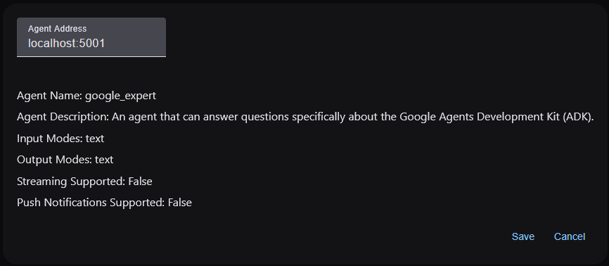
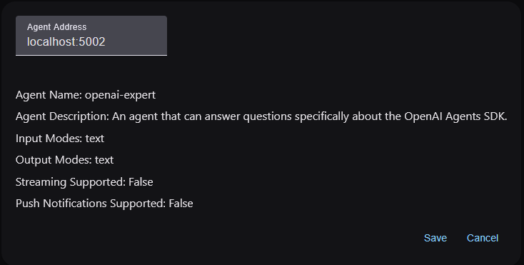
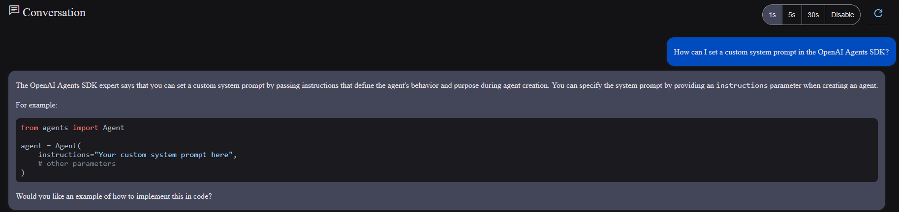

# Serving (A2A)

`any-agent` provides a simple way of serving agents from any of the supported frameworks using the
[Agent2Agent Protocol (A2A)](https://google.github.io/A2A/). You can refer to the link for more information on
the protocol, as explaining it is out of the scope of this page.

!!! warning

    The A2A protocol is in early stages of development and so is the functionality provided by `any-agent` here.

You can configuring and serve an agent using the [`ServingConfig`][any_agent.config.ServingConfig] and the [`AnyAgent.serve`][any_agent.AnyAgent.serve] method.

## Example

!!! info

    Until an official SDK is released ([see this issue](https://github.com/google/A2A/issues/423)),
    you need to install the A2A dependencies as follows:

    ```bash
    pip install "git+https://github.com/google/A2A#subdirectory=samples/python"
    ```

For illustrative purposes, we are going to define 2 separate scripts, each defining an agent to answer questions about a specific agent framework (either OpenAI Agents SDK or Google ADK):


=== "Google Expert"

    ```python
    # google_expert.py
    from any_agent import AgentConfig, AnyAgent
    from any_agent.config import ServingConfig
    from any_agent.tools import search_web

    agent = AnyAgent.create(
        "google",
        AgentConfig(
            name="google_expert",
            model_id="gpt-4.1-nano",
            instructions="You must use the available tools to find an answer",
            description="An agent that can answer questions specifically about the Google Agents Development Kit (ADK).",
            tools=[search_web]
        )
    )

    agent.serve(ServingConfig(port=5001))
    ```

=== "OpenAI Expert"

    ```python
    # openai_expert.py
    from any_agent import AgentConfig, AnyAgent
    from any_agent.config import ServingConfig
    from any_agent.tools import search_web

    agent = AnyAgent.create(
        "openai",
        AgentConfig(
            name="openai-expert",
            model_id="gpt-4.1-nano",
            instructions="You must use the available tools to find an answer",
            description="An agent that can answer questions specifically about the OpenAI Agents SDK.",
            tools=[search_web]
        )
    )

    agent.serve(ServingConfig(port=5002))
    ```

We can then run each of the scripts in a separate terminal and leave them running in the background.

There are multiple options to interact with these agents.
We are going to use the [example demo UI](https://github.com/google/A2A/blob/main/demo/README.md) and follow the instructions to get it running.

With the UI running, we can register the 2 new that are being served using their corresponding URLs:

=== "Google Expert"

    

=== "OpenAI Expert"

    

Now that the agents are registered, we can interact with the "host" agent that will (hopefully) redirect the request
to the appropriate expert:


